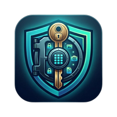

<p align="center">
  
</p>

<h1 align="center">VaultX</h1>

<p align="center">
  <strong>Military-Grade Local Password &amp; Media Vault for Android</strong>
</p>

<p align="center">
  <a href="#features"></a>
  <a href="#features"></a>
  <a href="https://flutter.dev"></a>
  <a href="LICENSE"></a>
</p>

<p align="center">
  <em>Your data never leaves your device. No servers. No cloud. No compromise.</em>
</p>

---

## 📋 Table of Contents

- [Overview](#overview)
- [Why VaultX?](#why-vaultx)
- [Features](#features)
- [Security Architecture](#security-architecture)
- [Tech Stack](#tech-stack)
- [Getting Started](#getting-started)
- [Project Structure](#project-structure)
- [Contributing](#contributing)
- [License](#license)

---

## Overview

**VaultX** is an open-source, offline-first password and encrypted media manager built with Flutter. Unlike commercial cloud-based password managers, VaultX assumes your device will eventually fall into the hands of a malicious actor. It is engineered with a hybrid zero-knowledge architecture, aggressive RAM watchdogs, and physical threat mitigations to ensure your data survives — or self-destructs — on your terms.

---

## Why VaultX?

Commercial cloud password managers protect you from remote hackers, but they fail against **physical threats**: the "Evil Maid" attack, a stolen unlocked phone, or forced coercion. VaultX is purpose-built for **physical threat modeling**.

| Threat | Cloud Managers | VaultX |
| :--- | :---: | :---: |
| Server breach / data leak | ❌ Vulnerable | ✅ No server exists |
| OS-level memory scraping | ❌ Plaintext in RAM | ✅ Aggressive RAM zeroing |
| Brute-force PIN attacks | ⚠️ Lockout timer | ✅ Cryptographic shredding |
| Physical device theft | ⚠️ Basic lock | ✅ Intruder selfie + self-destruct |
| Root / Jailbreak bypass | ❌ Exposed keychain | ✅ Environment integrity check |

---

## Features

### 🔐 Password Manager
- AES-256 encrypted local vault with categorized storage
- Password strength analysis with real-time scoring
- Breach detection via **Have I Been Pwned** k-Anonymity API
- One-tap secure password generator (alphanumeric, symbols, custom length)
- Auto-wipe clipboard after 15 seconds

### 🖼️ Encrypted Media Vault
- Separate PIN-protected media vault (photos & videos)
- In-app secure player — decrypted media never touches the OS gallery
- Files stored with randomized UUIDs + `.nomedia` OS blinding

### 🛡️ Active Defense Systems
- **Poison Pill** — Cryptographic shredding after 8 failed PIN attempts
- **Honeypot** — Silent front-camera intruder selfie on 3rd failed attempt
- **RAM Watchdog** — Session keys flushed the instant the app loses focus
- **Environment Integrity** — Blocks access on rooted/compromised devices

### 📊 Security Dashboard
- Visual vault health overview with breach statistics
- Password strength distribution charts
- Actionable security recommendations

---

## Security Architecture

```
┌─────────────────────────────────────────────────────┐
│                    USER INPUT                       │
│                  (6-digit PIN)                      │
└──────────────────────┬──────────────────────────────┘
                       │
                       ▼
        ┌──────────────────────────────┐
        │    PBKDF2-HMAC-SHA256        │
        │    100,000 iterations        │
        │    + Device-local salt       │
        └──────────────┬───────────────┘
                       │
                       ▼
        ┌──────────────────────────────┐
        │    AES-256-CBC Encryption    │
        │    Key derived in real-time  │
        │    Never persisted to disk   │
        └──────────────┬───────────────┘
                       │
              ┌────────┴────────┐
              ▼                 ▼
     ┌──────────────┐  ┌──────────────┐
     │  Passwords   │  │    Media     │
     │  (JSON Blob) │  │  (AES Files) │
     └──────────────┘  └──────────────┘
```

> **Zero-Knowledge Design:** The master AES key is never stored anywhere on the device. It is mathematically derived from your PIN + a local salt at runtime and evaporates from RAM the moment the app loses focus.

---

## Tech Stack

| Layer | Technology |
| :--- | :--- |
| **Framework** | Flutter 3.x (Dart) |
| **Encryption** | AES-256-CBC via `encrypt` + `pointycastle` |
| **Key Derivation** | PBKDF2-HMAC-SHA256 (100K iterations) |
| **Secure Storage** | Android Keystore via `flutter_secure_storage` |
| **Authentication** | Biometric (fingerprint/face) via `local_auth` |
| **Breach Detection** | Have I Been Pwned API (k-Anonymity) |
| **UI** | Material 3 + Custom Design System ("Vaulted Horizon") |

---

## Getting Started

### Prerequisites

- [Flutter SDK](https://flutter.dev/docs/get-started/install) ≥ 3.0.0
- Android SDK ≥ 21 (Android 5.0+)
- A physical Android device (recommended for camera & biometric features)

### Installation

```bash
# Clone the repository
git clone https://github.com/d0tahmed/VaultX.git
cd VaultX

# Install dependencies
flutter pub get

# Run on a connected device
flutter run
```

### Building a Release APK

```bash
flutter build apk --release
```

The output APK will be located at `build/app/outputs/flutter-apk/app-release.apk`.

---

## Project Structure

```
vaultx/
├── lib/
│   ├── main.dart                 # App entry point
│   ├── screens/
│   │   ├── home_screen.dart      # Password vault list
│   │   ├── dashboard_screen.dart # Security dashboard & analytics
│   │   ├── media_vault_screen.dart # Encrypted media vault
│   │   ├── settings_screen.dart  # App configuration
│   │   ├── lock_screen.dart      # Biometric / PIN gate
│   │   ├── pin_setup_screen.dart # First-time PIN creation
│   │   ├── pin_entry_screen.dart # Media vault PIN entry
│   │   └── main_shell.dart       # Bottom nav shell
│   ├── services/
│   │   ├── vault_provider.dart   # State management & encryption logic
│   │   └── security_service.dart # Keystore, brute-force tracking, camera
│   └── theme/
│       └── app_theme.dart        # Design system tokens
├── assets/
│   └── icon.png                  # App icon
├── android/                      # Android platform config
├── pubspec.yaml                  # Dependencies
└── README.md
```

---

## Contributing

Contributions are welcome! Please follow these steps:

1. **Fork** the repository
2. **Create** a feature branch (`git checkout -b feature/amazing-feature`)
3. **Commit** your changes (`git commit -m 'feat: add amazing feature'`)
4. **Push** to the branch (`git push origin feature/amazing-feature`)
5. **Open** a Pull Request

Please ensure your code follows the existing style and passes `flutter analyze` before submitting.

---

## License

This project is licensed under the **MIT License** — see the [LICENSE](LICENSE) file for details.

---

<p align="center">
  Made with ❤️ by <a href="https://github.com/d0tahmed"><strong>d0tahmed</strong></a>
</p>
